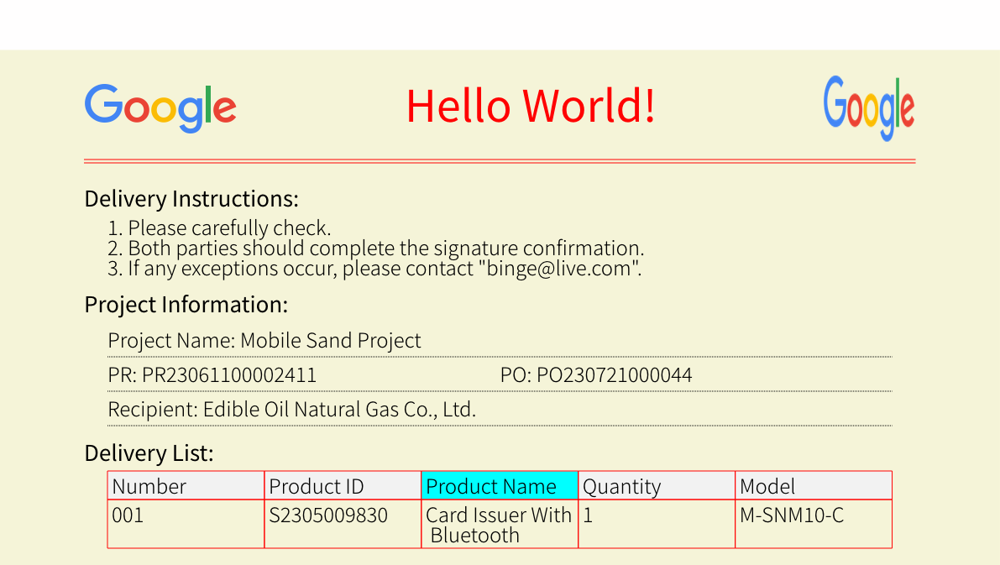

# Layout Engine for HTML(css support)

A **Layout Engine** for HTML with limited CSS support, implemented in pure Go. This project was written with the help of a large language model. This layout engine allows you to set the page width and then  automatically computes the height and width of children elements, taking into account the margin, padding, and border to achieve accurate layouts. Additionally, it provides a split page method that helps you convert HTML to PDF with line break support.

## Installation

To install and set up the project, follow these steps:

1. Clone the repository: `git clone https://github.com/html2any/layout.git`
2. Navigate to the project directory: `cd layout/example`
3. Install the required dependencies: `go build && ./example pdf complicated.html`

## Usage

Follow these instructions to use the project:
1. Load Fonts for compute and render
2. Define a text line break method
3. Init render for output
4. Load html that need to convert
5. Set Width and Layout each element,You will get then result height.
6. RenderTo a file 

### Demo Result


### Write HTML File
```html
<div style="font-size:12px;margin:5px 50px; height:700px; top:70px;background-color:#f5f4d8">
    <div id="htitle">
        
        <div>Delivery Note (Supplier)</div>
        
    </div>
    <div class="dline"></div>
       
    <div class="title">Delivery Instructions:</div>
    <div class="line">1. Please carefully check.</div>
    <div class="line">2. Both parties should complete the signature confirmation.</div>
    <div class="line">3. If any exceptions occur, please contact "xx@yy.com".</div>
    
    <div class="title">Project Information:</div>
    <table id="info">
      <tr><td>Project Name: Mobile Sand Project</td></tr>
      <tr><td>PR: PR23061100002411</td><td>PO: PO230721000044</td></tr>
      <tr><td>Recipient: Edible Oil Natural Gas Co., Ltd.</td></tr>
    </table>
    <div class="title">Delivery List:</div>
    <table id="plist">
      <tr style="background-color: #f2f2f2;"><td>Number</td><td>Product ID</td><td>Product Name</td><td>Quantity</td><td>Model</td></tr>
      <tr><td>001</td><td>S2305009830</td><td>Card Issuer With Bluetooth</<td><td>1</td><td>M-SNM10-C</td></tr>
      </table>
  </div> 
```
### Write Css.go. See `example/css.go`
```Go
var cssMap map[string]string = map[string]string{
	"tr":          `flex-direction: row;`,
	"#htitle":     `margin:0px;font-size:26px;text-align:center;display:flex;flex-direction:row;`,
	"#htitle>div": `flex:1;line-height:44px;font-weight: bold;color:#ff0000;`,
	".dline":      `border-top:0.5px solid #f00;border-bottom:0.5px solid #f00;padding-top:1px;margin:5px 0px`,
	...
}
```
### Convert Demo 
```Go
func main() {
	format := os.Args[1]
	// loadFonts and CacheAll
	fontcache := loadFonts()
	textspliter := fonts.NewSFNT(fontcache)
	if _, err := textspliter.CacheAll(); err != nil {
		panic(err)
	}
	// init render
	render := initRender(format, fontcache)

	// load html
	root := parseHTML2Block()

	_, err := layout.CacuHeight(root, layout.A4_Width, "NotoSansSC", textspliter)
	if err != nil {
		panic(err)
	}
	if format == "img" {
		render.(*ImageRender).NewCanvas(root.Width, root.Height+root.Top)
		layout.RenderTo(root, render, 0, 0)
		out := render.GetData()
		os.WriteFile("out.png", out, 0644)
	}
}
```

## Css support list
```css
top
flex
flex-direction
overflow
margin|margin-top|margin-right|margin-bottom|margin-left
padding|padding-top|padding-right|padding-bottom|padding-left
text-align|vertical-align
background-color
font-family|font-style|font-size|font-color
height
line-height
width
border|border-top|border-right|border-bottom|border-left
border-[top|right|bottom|left]-color
border-[top|right|bottom|left]-style
```
## Tag support
1. Any tag name
2. Attributes: class,src,style,id

## More Usage
1. TextSplit is an interface.
2. Render is an interface.
3. You can define your own impliment.

## Performance
1. Html parser is faster than `json.Unmarshal` [parser](https://github.com/html2any/parser)
2. Recursive calculation is almost the same as stack. I chose to use recursion, which is better understood.
3. The calculation of text lines will take some time.
4. Rendering to pdf or image is fast enough
5. The most expensive is encoding to pdf or png

## Contributing

Contributions to the project are welcome! If you would like to contribute, please follow these guidelines:

1. Fork the repository.
2. Create a new branch: `git checkout -b feature/your-feature`.
3. Make your changes and commit them: `git commit -m 'Add some feature'`.
4. Push to the branch: `git push origin feature/your-feature`.
5. Open a pull request.

Please ensure that your code adheres to the project's coding style and includes appropriate tests.

## License

This project is licensed under the MIT License. See the [LICENSE](LICENSE) file for more information.
